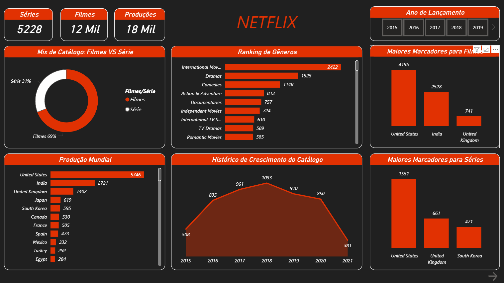

# 📺 Dashboard de Análise Netflix

## 📌 Sobre o Projeto
Análise estratégica do catálogo global da Netflix, focada em entender a distribuição de conteúdo e o comportamento das produções ao longo dos anos.

## 📊 Insights do Dashboard
* **Mix de Catálogo:** Predominância de Filmes (69%) em relação a Séries (31%).
* **Produção Mundial:** Liderança absoluta dos Estados Unidos com 5.746 produções.
* **Frescor do Catálogo:** Identificação de que 15,43% do conteúdo é considerado "Novo".
* **Público Alvo:** O volume de conteúdo é majoritariamente voltado para o público Adulto.

## 🖼️ Visualização

